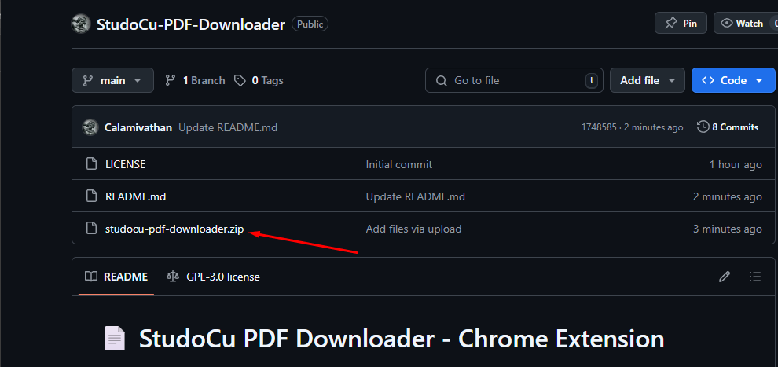
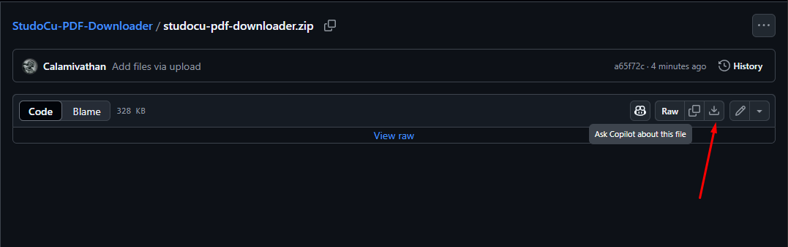
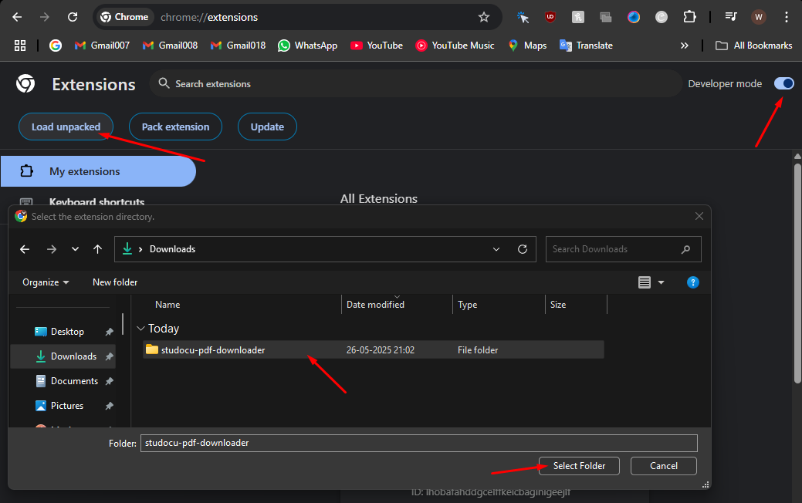

# 📄 StudoCu PDF Downloader - Chrome Extension

🚀 **Easily download premium StudoCu documents as high-quality PDFs — no login or premium subscription required.**
🛠️ Built for students, by a student. 100% free and privacy-respecting.

---

## ✨ What It Does

**StudoCu PDF Downloader** is a powerful browser extension that helps students and learners bypass limitations on **Studocu.com** and download full documents in PDF format — even when blurred or partially locked.

With a single click, you can:

* 📥 Download entire Studocu documents page by page as clear images
* 📄 Automatically combine them into a printable, searchable PDF
* 🔒 Bypass Studocu’s premium wall — no account or subscription needed
* 🧠 Save study material offline for exam prep, assignments, and revision

---

## 🎯 Who Is It For?

This tool is specially made for:

* **Students preparing for exams**
* **College/university learners** who want free access to study guides, solved papers, or notes
* **Researchers** looking for reference material without restrictions
* Anyone frustrated with locked/blurry Studocu previews

---

## 🧩 Features

* ✅ One-click PDF download from any Studocu document page
* ✅ Works with most public and premium documents
* ✅ Clean, easy-to-use UI with live progress
* ✅ No sign-in required
* ✅ Completely free and open-source

---

## 🧰 How to Set It Up

### 📦 Load Unpacked Extension (Recommended)

1. Download the ZIP from the [repo](https://github.com/Calamivathan/StudoCu-PDF-Downloader)
2. **Unzip the folder** to your computer
3. Open Chrome and go to `chrome://extensions/`
4. Enable **Developer Mode** (toggle at top-right)
5. Click **“Load unpacked”** and select the **unzipped folder**

✅ Extension will now appear in your toolbar!

---

## 📸 Screenshots

### 🔍 Preview from Studocu Page

### 📥 Extension in Action (Popup UI)

### 📄 Downloaded PDF Result

---

## 📄 How to Use

1. Go to any Studocu document page
2. Click the extension icon
3. Press **“Download as PDF”**
4. Wait while:

   * All pages are detected
   * Images are downloaded
   * PDF is generated and downloaded

📂 You can then open, save, or print the file!

---

## 📊 Live Stats

The extension tracks how many PDFs have been generated globally, and displays it inside the popup for fun — no personal data is collected.

---

## 🙌 Why I Built This

I was tired of hitting a paywall just to review past papers or assignments uploaded by students like me. This extension is a small step to ensure **knowledge stays accessible** — without ads, login walls, or fees.

> 🧠 **Built by a learner, for learners.**

---

## 🧠 FAQ

### ❓ Does it require a Studocu account?

No. It works even if you’re not logged in.

### ❓ Does it work on all documents?

It supports most public and even premium-blurred documents with visible image data.

### ❓ Is it legal?

Use this **only for personal, educational purposes**. Downloading or redistributing copyrighted material without permission may violate Studocu’s TOS.

### ❓ Does it track or collect data?

No. The extension does not store, send, or collect any of your browsing or personal information.

---

## ❤️ Support the Project

If this helped you:

* ⭐ Star the repo
* 📤 Share with fellow students

---

## 👨‍💻 Author

Made by [Calamivathan](https://github.com/Calamivathan)
🗿 “I break things to build them better.”

---

## ⚠️ Disclaimer

This project is for educational use only. The developer is not responsible for misuse. Use at your own discretion and respect intellectual property laws.

---

Let me know if you'd like a version optimized for the Chrome Web Store too!
